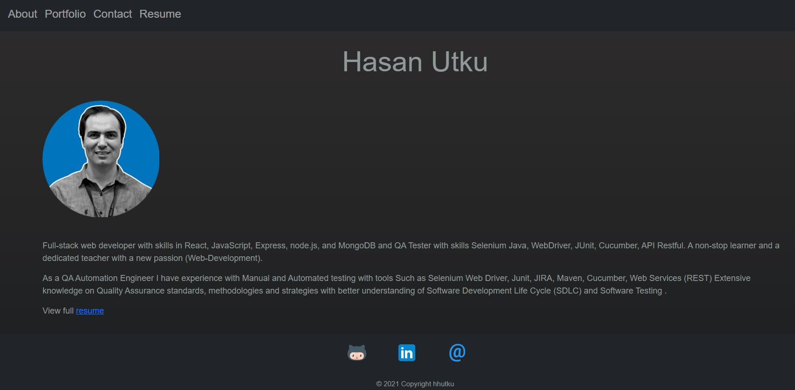

# my-react-portfolio

## Description

This is my responsive portfolio built with React and served up via Express to Heroku. The app uses Bootstrap for a style library. 

The homepage provides my professional statement. The portfolio page provides descriptions and links for my projects. The contact page provides information for getting in touch with me and a link to my resume.

## Installation
1. Clone the Github Repository [here](https://github.com/hhutku/my-react-portfolio).
2. Run ```npm install``` to install dependencies and then run ```npm start```

## Usage
Visit the deployed app: [Hasan Utku Portfolio](https://my-rt-portfolio.herokuapp.com)

## Images




## Credits
I, Hasan Utku, was the sole contributor on this project.


 